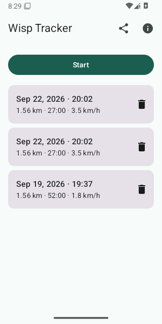
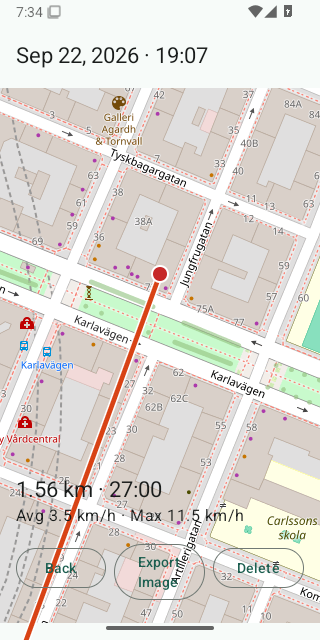

# Wisp

A very simple GPS tracker for any activity — running, cycling, walking, or
anything else. Tracks your route, distance, and speed, and keeps a local
history on your phone. No accounts, no cloud, no activity types, no
sport-specific settings.

<a href="https://play.google.com/store/apps/details?id=com.github.tomasbjerre.wisp">
  
</a>

*(Link goes live once the first release is published — see [Play Store release](android/README.md#play-store-release).)*

## Screenshots

 

## Structure

- [`specs/`](specs/README.md) — implementation-independent specification
  of what Wisp does. Read this first. Any implementation must conform to
  it; if behavior needs to change, change the spec, not just the code.
- [`android/`](android/README.md) — the native Android (Kotlin + Jetpack
  Compose) implementation.

## Android quick start

See [`android/README.md`](android/README.md) for local dev setup.

```bash
cd android
./gradlew assembleDebug
```

## License

Apache License 2.0 — see [LICENSE](LICENSE).
