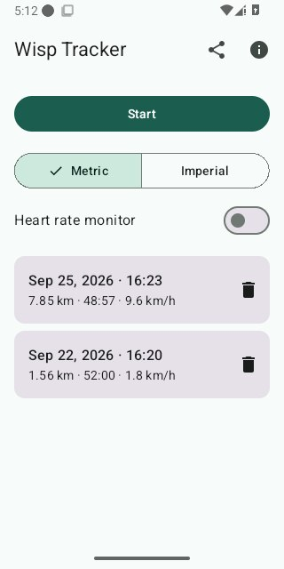
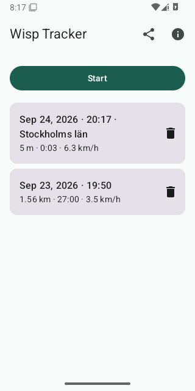
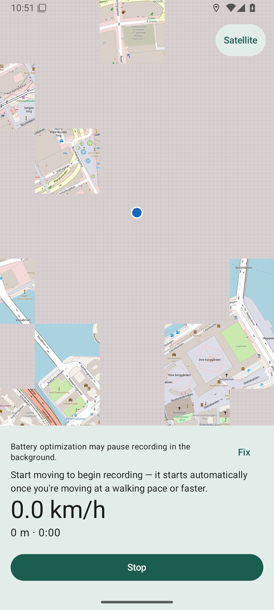
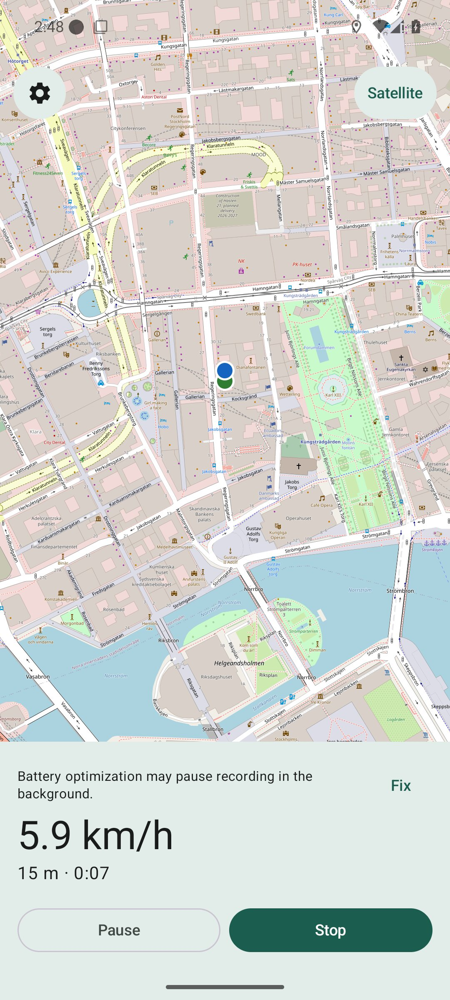
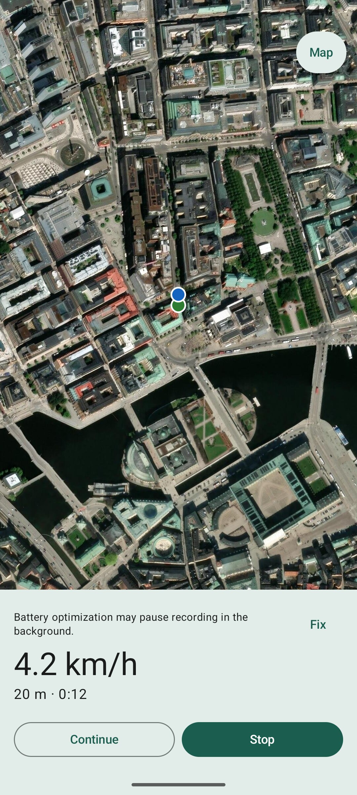
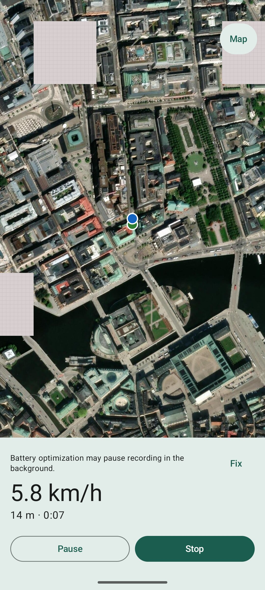
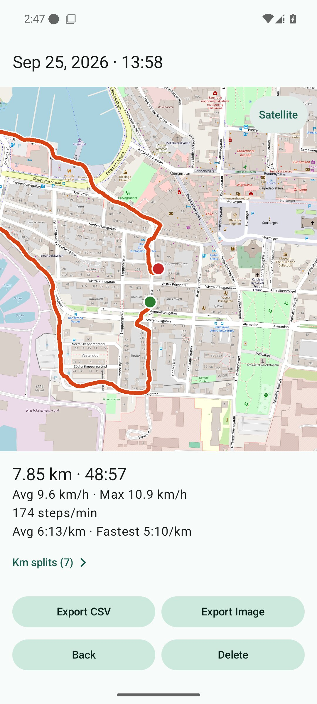
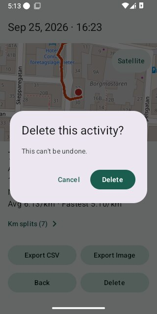

# Wisp — User Manual

A walkthrough of every screen and control in Wisp, with screenshots. If
you're trying to find out how to do something in the app, this is the
place; if you're reviewing a pull request, this document should already
reflect whatever screen or control it touched — see
[`../AGENTS.md`](../AGENTS.md).

Wisp has three screens: **Home**, **Tracking**, and **Detail**. For the
precise, implementation-independent contract behind everything described
here, see [`../specs/`](../specs/README.md) — this manual is the
user-facing companion to that, not a replacement for it.

## Home

This is what you see when you open Wisp. It has:

- **Start** — the button at the top. Tap it to begin recording a new
  activity (run, ride, walk, anything). See [Tracking](#tracking) below
  for what happens next.
- **Your history** — every past activity, most recent first, each row
  showing its date, nearest city (when known), distance, duration, and
  average speed. Tap a row to open that activity's [Detail](#detail)
  screen.
- **Delete** — the trash icon on each row deletes that activity directly
  from Home, without having to open it first. You'll be asked to confirm.
- **Feedback** — the ⓘ icon in the top-right opens Wisp's GitHub issues
  page in your browser, for bug reports or feature requests.

The first time you open Wisp, before you've recorded anything, the
history list is replaced with a short empty-state message instead:

## Tracking

Entered by tapping Start. This is the screen you'll see while an activity
is actively being recorded — it stays active even if you lock your phone
or switch to another app.

Tapping Start doesn't jump straight into recording — it goes through two
short steps first:

1. **Finding your location** — a brief loading state while your phone
   acquires a GPS fix. There's nothing to show yet, so no map appears
   until this resolves.
2. **Waiting for movement** — once your position is known, the map
   appears, but the timer and distance stay at zero:

   

   This is deliberate: if recording started the instant you tapped
   Start, the moments spent fumbling with your phone or walking to the
   start line would count as part of your activity. Once you're actually
   moving at a walking pace or faster, recording begins automatically —
   no need to tap anything.

Once recording is underway, the screen shows your route being drawn live
on the map, along with your current speed, distance, and elapsed time:

A few more things on this screen:

- **Satellite/Map toggle** — the pill button over the top-right corner of
  the map switches between the standard street map and a satellite view,
  useful for checking terrain. It resets back to the standard map next
  time you start a new activity.
- **Steps and last km split** — once you have a step count or have
  completed at least one kilometer, this screen also shows your current
  steps/minute and how long that last kilometer took. (Not every phone
  has a step-count sensor — if yours doesn't, or the permission wasn't
  granted, this line simply doesn't appear.)
- **Pause / Continue** — pauses recording without ending the activity;
  tap Continue to resume. Wisp also pauses automatically if you stop
  moving for a while (about 15 seconds) — same button, same behavior,
  it's just triggered for you instead of by a tap:

  

- **Stop** — ends the activity and takes you to its [Detail](#detail)
  screen. If you tap Stop before movement was ever confirmed (you were
  still on the "waiting for movement" step), there's nothing meaningful
  to save, so the activity is discarded and you're returned to Home
  instead.
- **Back** — the system/gesture back action does exactly what Stop does
  (finalize the activity and navigate on) rather than silently leaving
  it running in the background — there's no way to abandon a recording
  session with a stray back tap.

Here's the satellite view from the toggle mentioned above:

## Detail

Opened by tapping a history row on Home, or automatically after tapping
Stop on Tracking. Shows everything about one activity, past or
just-finished:

- **Map** — the full route, with a marker at the start and end.
- **Summary stats** — date/time, nearest city, distance, duration,
  average and max speed, and (when available) steps/minute.
- **Km splits** — how long each completed kilometer took, one row per
  split. Shown only once you've covered at least 1 km.
- **Back** — returns to wherever you came from (Home, or straight here
  after finishing a recording).
- **Export Image** — shares a snapshot of the route map and stats as an
  image, via Android's normal share sheet (save it, send it, post it —
  your choice, same as sharing a photo from any other app).
- **Export CSV** — shares the activity's data as two CSV files (one row
  summarizing the activity, one with every recorded GPS point), also
  through the share sheet. Useful for importing into a spreadsheet or
  another tool.
- **Delete** — removes the activity permanently. Asks you to confirm
  first, since this can't be undone:

  

## That's everything

Three screens, no settings, no accounts — that's the whole app. If
something here doesn't match what you're seeing, or you think something's
missing, use the feedback link on Home (see above) to let us know.
