# Wisp — User Manual

A walkthrough of every screen and control in Wisp, with screenshots. If
you're trying to find out how to do something in the app, this is the
place; if you're reviewing a pull request, this document should already
reflect whatever screen or control it touched — see
[`../AGENTS.md`](../AGENTS.md).

Wisp has three main screens: **Home**, **Tracking**, and **Detail** —
plus a [Km splits](#km-splits) view you can open from Detail. For the
precise, implementation-independent contract behind everything described
here, see [`../specs/`](../specs/README.md) — this manual is the
user-facing companion to that, not a replacement for it.

## Home

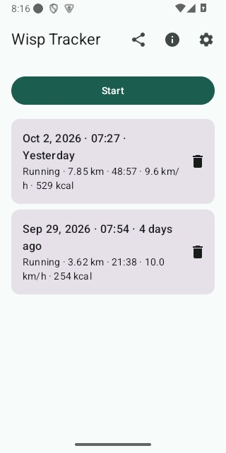

This is what you see when you open Wisp. It has:

- **Start** — the button at the top. Tap it to begin recording a new
  activity (run, ride, walk, anything). See [Tracking](#tracking) below
  for what happens next.
- **Metric / Imperial** — switches every distance, speed, and pace Wisp
  shows between kilometers/km per hour and miles/mph, everywhere it's
  shown (Home, Tracking, Detail, Km splits — which becomes Mile splits
  under imperial, with whole-mile splits rather than kilometers
  re-expressed in miles). Metric by default. CSV exports always stay in
  metric regardless of this setting — see the user manual's Detail
  section below.
- **Your history** — every past activity, most recent first, each row
  showing its date, place name (when known — a neighborhood if one is
  found, otherwise the city), what kind of activity it was (Walking,
  Running or Cycling — when known), distance, duration, average speed, and
  calories burned (when the activity has them). Tap a row to open that activity's [Detail](#detail)
  screen.
- **Delete** — the trash icon on each row deletes that activity directly
  from Home, without having to open it first. You'll be asked to confirm.
- **Export CSV** — the share icon in the top-right exports your whole
  history as two CSV files (one row per activity, and one with every
  recorded GPS point). Tapping it offers a choice: **Share** (through
  Android's share sheet, same as before) or **Save to device** (writes
  the files straight to a folder you pick, no other app needed — handy
  if you just want a local copy without routing it through a cloud app
  first). The file names carry the time of the export, e.g.
  `wisp-history-2026-09-25_07-18-03.csv`, so the newest (most complete)
  export is easy to spot among older ones.
- **Information** — the ⓘ icon in the top-right opens a small dialog with
  Wisp's version and your device model/Android version (handy if you're
  about to report a bug — issue reports ask for both, in the same
  format shown here, so you can copy them straight in), a link to
  report a problem or request a feature (opens Wisp's GitHub issues in
  your browser), and a link to this manual:

  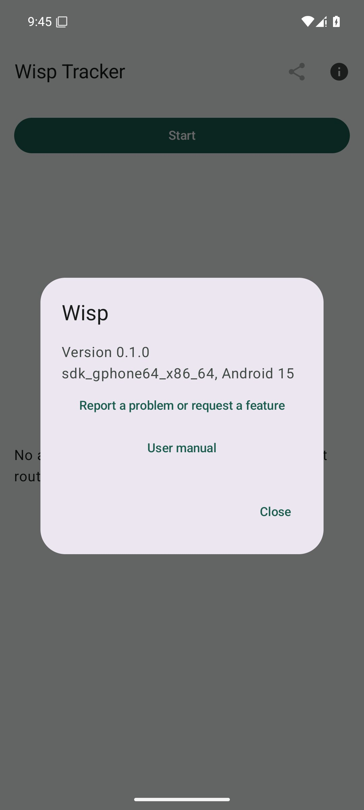

The first time you open Wisp, before you've recorded anything, the
history list is replaced with a short empty-state message instead:

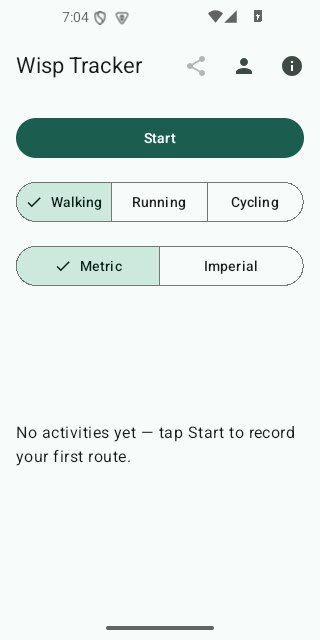

## Weight and calories

Wisp can estimate the calories an activity burned, but only once it knows
your weight. You enter it on **Settings**, opened from the gear icon on
[Tracking](#tracking) — see [Settings](#settings) below — in kilograms,
or pounds if you've chosen Imperial. It's saved as you type, takes effect
on the activity you're recording right away, and clearing the field turns
calories off again for that activity.

- **Which weight is used:** whatever weight is showing on Settings is what
  that activity's calories are worked out from, at every point while it's
  being recorded — change it partway through and the whole activity
  re-estimates from the new value, the same way changing the activity type
  does. Once you stop, it's fixed: a later change only affects activities
  after that point, and doesn't touch this one. An activity you stopped
  before ever entering a weight never shows calories, even if you enter one
  afterwards. Whatever you last entered is also what the next activity
  starts with, so you don't have to retype it every time.
- **How it's calculated:** calories = MET × your weight in kg × hours, where
  the MET (how demanding the activity is) depends on whether you chose Walking,
  Running or Cycling on Tracking and on your average speed. It's an estimate, not a
  measurement. Time spent paused doesn't count.
- **Where you see it:** in each row of your history on Home, live while
  recording on Tracking, and in the summary on Detail — as `Calories: 312 kcal`.
  It isn't part of the CSV exports.
- Activities recorded before this existed have no calories.

## Tracking

Entered by tapping Start. This is the screen you'll see while an activity
is actively being recorded — it stays active even if you lock your phone
or switch to another app.

Tapping Start doesn't jump straight into recording — it goes through two
short steps first:

1. **Finding your location** — a brief loading state while your phone
   acquires a GPS fix. There's nothing to show yet, so no map appears
   until this resolves.
2. **Waiting for movement** — once your position is known, the map
   appears, but the timer and distance stay at zero:

   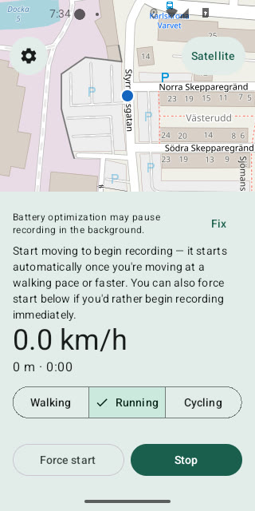

   This is deliberate: if recording started the instant you tapped
   Start, the moments spent fumbling with your phone or walking to the
   start line would count as part of your activity. Once you're actually
   moving at a walking pace or faster, recording begins automatically —
   no need to tap anything. Don't want to wait? Tap **Force start**,
   shown in place of Pause during this step, to begin recording right
   away.

Once recording is underway, the screen shows your route being drawn live
on the map, along with your current speed, distance, and elapsed time:

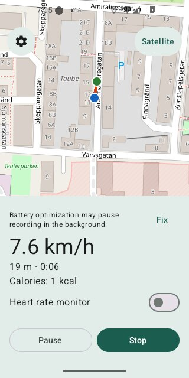

A few more things on this screen:

- **Notification** — while you record, Wisp keeps a notification in your
  notification shade (swipe down from the top) showing your distance and
  time, plus "paused" or "waiting to move" when that applies. Tap it to come
  straight back to this screen from anywhere. The first time, Android asks
  whether Wisp may show notifications — say yes to get it. If they're off,
  a line above the stats says so, with a **Fix** button that opens Wisp's
  notification settings:

  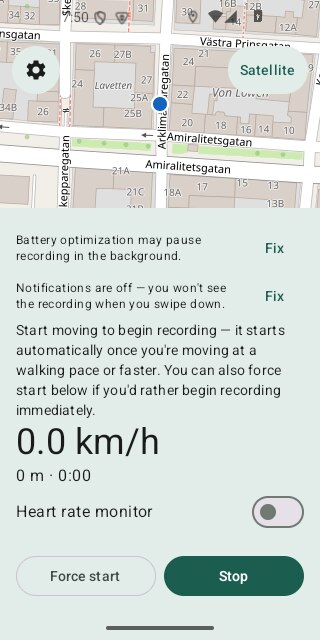

- **Satellite/Map toggle** — the pill button over the top-right corner of
  the map switches between the standard street map and a satellite view,
  useful for checking terrain. It resets back to the standard map next
  time you start a new activity.
- **Steps and km splits** — once you have a step count or have completed
  at least one kilometer, this screen also shows your current
  steps/minute, how long that last kilometer took, and (once you've
  completed a second one) your fastest kilometer so far. (Not every
  phone has a step-count sensor — if yours doesn't, or the permission
  wasn't granted, the steps line simply doesn't appear.)
- **Walking / Running / Cycling** — what you are doing. It starts on the type
  of your last activity (Walking if you have none) and you can change it
  at any point while recording, paused or waiting to move included. It only
  decides how calories are estimated — see
  [Weight and calories](#weight-and-calories) — and doesn't change how
  anything is recorded. Once you stop, it can't be changed.
- **Calories** — `Calories: 312 kcal` so far, once a weight is set (see
  [Weight and calories](#weight-and-calories)).
- **Heart rate** — with the Heart rate monitor switch on Settings turned
  on (see [Settings](#settings) below), shows your current heart rate and
  your maximum so far, e.g. `Heart rate: 142 bpm · Max 168 bpm`. It shows
  a dash while Wisp is still looking for a monitor or hasn't heard from
  it for a few seconds. With the switch off, this line doesn't appear.
- **Pause / Continue** — pauses recording without ending the activity;
  tap Continue to resume. Wisp also pauses automatically if you stop
  moving for a while (about 15 seconds) — same button, same behavior,
  it's just triggered for you instead of by a tap. Unlike a pause you
  started yourself, an automatic pause also ends on its own once you've
  covered about 30 meters, so a stop at a crossing doesn't cost you the
  rest of your run if you don't notice it. (Wisp keeps reading your
  location while paused, so your exported data still shows where you
  went — it just isn't counted.):

  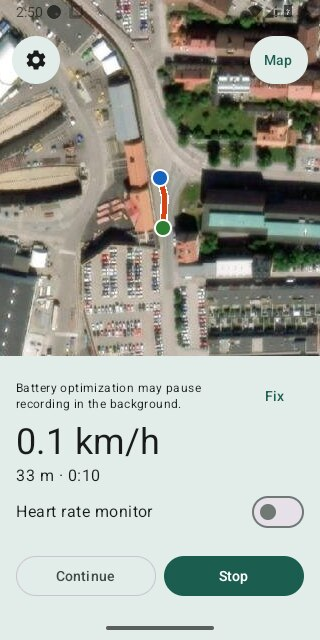

- **Stop** — ends the activity and takes you to its [Detail](#detail)
  screen. If you tap Stop before movement was ever confirmed (you were
  still on the "waiting for movement" step), there's nothing meaningful
  to save, so the activity is discarded and you're returned to Home
  instead.
- **Back** — while you're still on the "waiting for movement" step (before
  Force start, before you've actually started moving), the system/gesture
  back action stops immediately with no confirmation — same as tapping
  Stop at that point, since nothing has been recorded yet. Once recording
  has actually started, back instead asks **Stop recording?** first —
  **Stop** does exactly what the Stop button does (finalize the activity
  and navigate on), **Keep recording** carries on as if nothing happened.
  So there's no way to end or abandon real recorded data with a stray back
  tap:

  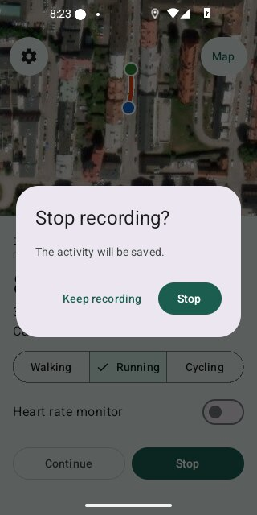

- **Settings** — the gear icon opens a settings screen for everything
  that only makes sense while recording — your weight, the heart rate
  monitor switch, and optional spoken voice feedback (handy with
  earbuds, so you get progress updates without looking at your phone):

  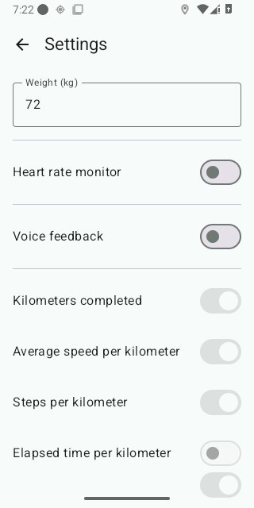

  From top to bottom:
  - **Weight** — see [Weight and calories](#weight-and-calories) above.
  - **Heart rate monitor** — off by default, stays as you left it the
    next time you record. Turn it on to record your heart rate from a
    Bluetooth heart rate monitor (a chest strap, arm band, or watch that
    broadcasts heart rate using the standard Bluetooth Heart Rate
    profile). Android will ask for permission to use nearby devices the
    first time; if you decline, the switch stays off. You can flip it at
    any point in the recording. Wisp looks for a monitor once you're
    moving, and keeps looking if the connection drops. If Bluetooth is
    off the switch is greyed out and turned off. With no monitor in
    range, recording works as usual — that activity just has no heart
    rate.
  - A master **Voice feedback** switch, off by default, plus five
    switches for what each announcement includes: **Kilometers
    completed**, **Average speed per kilometer**, **Steps per
    kilometer** (hidden when your session has no step count at all),
    **Elapsed time per kilometer** (how long the last kilometer took,
    off by default) and **Total elapsed time** (since the session
    started). Announcements happen once per completed kilometer, only
    while actively recording (not paused).

  Every field/switch on this screen persists across app restarts and
  takes effect immediately, even mid-session.

Here's the satellite view from the toggle mentioned above:

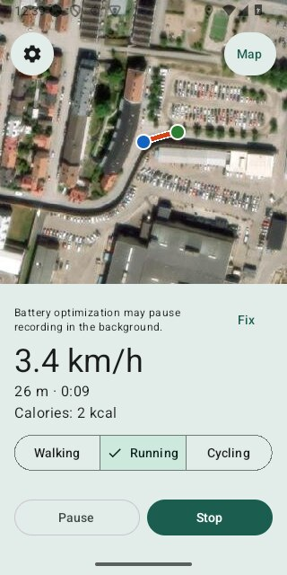

## Detail

Opened by tapping a history row on Home, or automatically after tapping
Stop on Tracking. Shows everything about one activity, past or
just-finished:

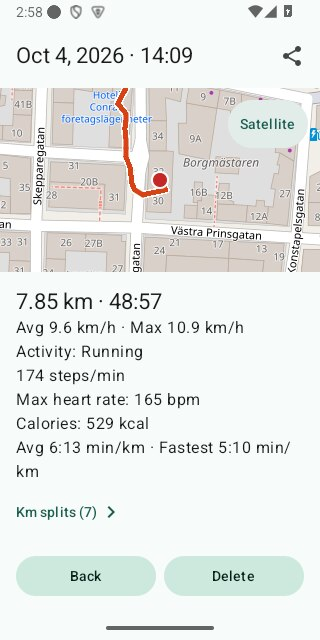

- **Map** — the full route, with a marker at the start and end, and the
  same Satellite/Map toggle described under [Tracking](#tracking) above,
  over the top-right corner:

  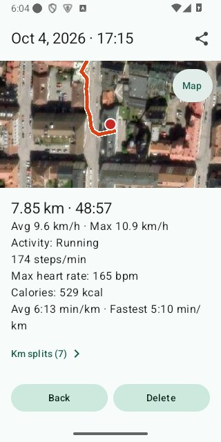

- **Summary stats** — date/time, place name, distance, duration,
  average and max speed, (when available) steps/minute, max heart rate
  (when a heart rate was recorded), the activity type and calories burned
  (when the activity has them), and (once
  you've completed at least one kilometer) your average time per
  kilometer, plus your fastest one once you've completed a second.

- **Km splits (N)** — opens the [Km splits](#km-splits) view, N being
  the number of complete kilometers. Shown only once you've covered at
  least 1 km.
- **Export CSV** — offers the same Share/Save to device choice as Home's
  Export CSV (above), for this one activity's data as two CSV files (one
  row summarizing the activity, one with every recorded GPS point).
  Useful for importing into a spreadsheet or another tool. The GPS
  points file includes every fix Wisp received — even ones it didn't
  count — with each fix's accuracy, whether it was flagged as noise and
  why, and where a pause broke the route (and whether you or auto-pause
  caused it), so you can see exactly why a stretch wasn't counted. Both files —
  and the Export Image file — are named after the activity's start time,
  e.g. `wisp-activity-2026-09-25_06-51-12.csv`, so exports of different
  activities never get mixed up. Always in metric, regardless of Home's
  Metric/Imperial setting — a predictable unit for spreadsheets and other
  tools, whatever's on screen at the time.
- **Export Image** — the same Share/Save to device choice, for a
  snapshot of the route map and stats as an image (save it, send it,
  post it — your choice, same as sharing a photo from any other app).
  Follows Home's Metric/Imperial setting, unlike Export CSV — it's a picture of
  what's already on screen.
- **Back** — returns to wherever you came from (Home, or straight here
  after finishing a recording).
- **Delete** — removes the activity permanently. Asks you to confirm
  first, since this can't be undone:

  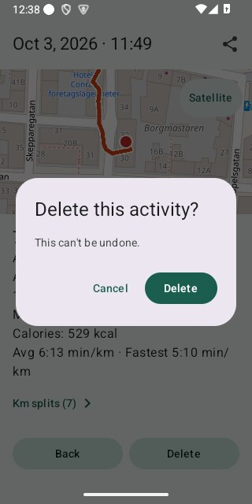

## Km splits

Opened with the **Km splits** link on Detail (titled **Mile splits**
under imperial), for analyzing an activity kilometer by kilometer — or
mile by mile, with imperial selected on Home. An activity shorter than
one full kilometer/mile has no complete split to count, so the link has
no number and the view shows just the distance covered so far:

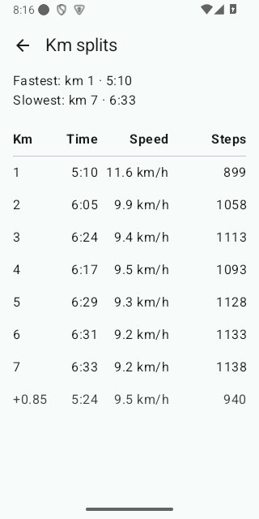

- **Fastest / Slowest** — which kilometer was quickest and which was
  slowest, with their times. Shown once there are at least two complete
  kilometers to compare.
- **One row per kilometer** — its number, how long it took, your average
  speed over it, and how many steps you took over it (when your phone
  counts steps — see [Tracking](#tracking)).
- **The last partial kilometer** — the bit after your last complete
  kilometer (e.g. `+0.40` for the last 400 m), dimmed since its time and
  steps cover a shorter distance than the others. Its speed still
  compares directly.
- **Back** — the arrow in the top-left (or your phone's back gesture)
  returns to Detail.

## That's everything

Three screens, no settings, no accounts — that's the whole app. If
something here doesn't match what you're seeing, or you think something's
missing, use the feedback link on Home (see above) to let us know.
